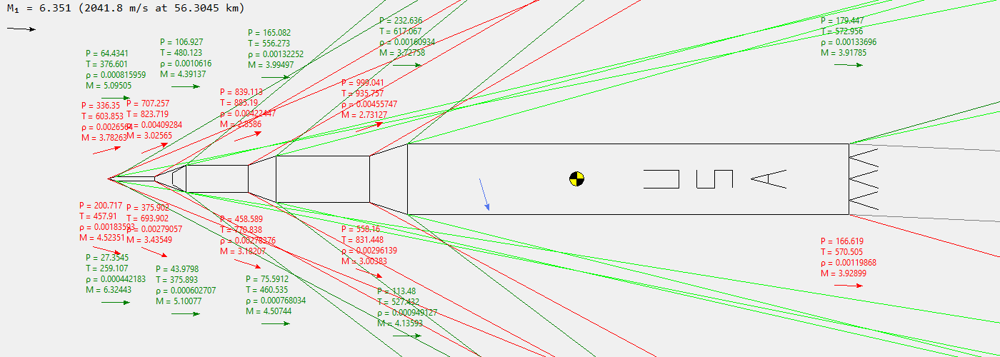

# Hypersonic Aerodynamics

Launch `Aero.py` for GUI.

Will generate files `DSMdata.csv`, `IFPdata.csv`, `MNuMudata.csv` and `Shockdroitdata.csv` in the same folder.

`Tables.py` is used by the main application and will generate files and plot tables when launched.

```bash
pip install scipy      # version 1.6.1
pip install numpy      # version 1.20.1
pip install matplotlib # version 3.3.4
```

Example simulation of the Saturn V rocket at t=150s using data from [flightclub.io](https://flightclub.io/result/2d?id=3959b61f-bcd7-48e7-94f0-d6384f473c69).



Built using pyinstaller.

```bash
pyinstaller # version 4.2
```

Python 3.9.2
